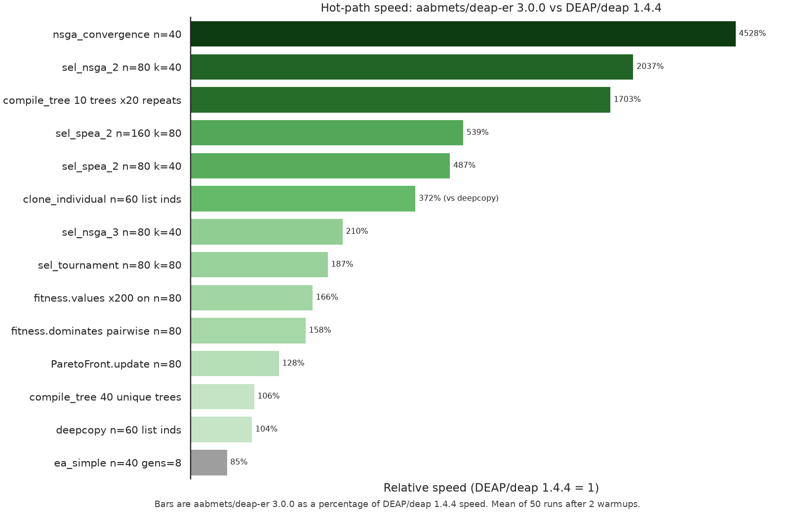

# DEAP-ER

[](https://pypi.org/project/deap-er/)
[](https://github.com/aabmets/deap-er/blob/main/LICENSE)
[](https://codecov.io/gh/aabmets/deap-er)
[](https://github.com/aabmets/deap-er/actions/workflows/pytest-codecov.yml)

[](https://sonarcloud.io/summary/new_code?id=aabmets_deap-er)
[](https://sonarcloud.io/summary/new_code?id=aabmets_deap-er)
[](https://sonarcloud.io/summary/new_code?id=aabmets_deap-er)
[](https://sonarcloud.io/summary/new_code?id=aabmets_deap-er)<br/>
[](https://sonarcloud.io/summary/new_code?id=aabmets_deap-er)
[](https://sonarcloud.io/summary/new_code?id=aabmets_deap-er)
[](https://sonarcloud.io/summary/new_code?id=aabmets_deap-er)
[](https://sonarcloud.io/summary/new_code?id=aabmets_deap-er)

DEAP-ER is a rewrite of [DEAP](https://github.com/DEAP/deap) for Python 3.12
and newer. The toolbox model is the same — register operators, run an
algorithm — and so are the families of methods listed below. The package is
typed, uses snake_case, and the published API is what the documentation
describes.

It is not a drop-in rename. Function names, parameter order, and a few
contracts changed. The
[differences page](https://aabmets.github.io/deap-er/overview/differences/)
is the migration note.

```bash
pip install deap-er
```
```bash
uv add deap-er
```

## Capabilities

- Genetic algorithms on ordinary Python containers (list, array, set,
  dict, tree, NumPy array, and similar)
- Genetic programming on prefix trees: loosely typed, strongly typed, and
  automatically defined functions
- Evolution strategies (covariance matrix adaptation)
- Multi-objective search (SPEA-II, NSGA-II, NSGA-III, SMS-EMOA, MOEA/D,
  AGE-MOEA-II, MO-CMA)
- Cooperative and competitive co-evolution
- Parallel evaluation with multiprocessing or
  [Ray](https://github.com/ray-project/ray)
- Statistics, hall of fame, and a NetworkX-compatible genealogy
- Checkpoints that persist a run to disk
- Benchmarks against common test functions
- Worked examples of symbolic regression, particle swarm, differential
  evolution, and estimation of distribution

## Relative to DEAP

Same toolbox model. Counted from the
[differences](https://aabmets.github.io/deap-er/overview/differences/)
inventory:

- **18** still-open [DEAP](https://github.com/DEAP/deap) issues
  [implemented](https://aabmets.github.io/deap-er/bugfixes/deap_fixes/) (some older than a decade)
- **48** correctness bugs fixed — [operators](https://aabmets.github.io/deap-er/bugfixes/operators/),
  [GP](https://aabmets.github.io/deap-er/bugfixes/gp/),
  [CMA](https://aabmets.github.io/deap-er/bugfixes/strategies/),
  [records](https://aabmets.github.io/deap-er/bugfixes/records/),
  [checkpoints](https://aabmets.github.io/deap-er/bugfixes/persistence/),
  published [benchmarks](https://aabmets.github.io/deap-er/bugfixes/benchmarks/),
  [creator](https://aabmets.github.io/deap-er/bugfixes/creator/),
  [utilities](https://aabmets.github.io/deap-er/bugfixes/utilities/),
  and [algorithms](https://aabmets.github.io/deap-er/bugfixes/algorithms/)
- **37** capabilities DEAP does not have, including boxed CMA,
  mixed-gene mutation, logbook JSON, and
  [columnar GP](https://aabmets.github.io/deap-er/tutorials/columnar_gp/):
  - boxed blend crossover (`cx_blend_bounded`)
  - boxed Gaussian mutation (`mut_gaussian_bounded`)
  - per-gene `mut_heterogeneous` / `cx_heterogeneous`
  - crowding on `wvalues` (`use_weights`)
  - `sel_tournament_dcd` for any valid `k`
  - lexicase / ε-lexicase with `cases=`, `sample_informed_cases`, and `fitness_case_matrix`
  - `sel_team` (greedy max-coverage of cases solved at 0)
  - co-evolving case exams (`CaseExam` / `CaseExamPool`, `score_case_exams`, `next_lexicase_cases`)
  - SMS-EMOA, MOEA/D, and AGE-MOEA-II selection
  - constraint-dominance on `sel_nsga_2` (`feasible=` / `violation=`)
  - boxed CMA (`low`/`up`, clip or resample) 
  - separable CMA (`StrategySeparable`)
  - IPOP/BIPOP `RestartStrategy` / `ea_generate_update_restarts`
  - leaf-only `generate()` 
  - weighted primitives 
  - `call_zero` terminals 
  - infix pretty-printer
  - [columnar GP](https://aabmets.github.io/deap-er/tutorials/columnar_gp/):
    `make_column_pset`, NumPy / window / pair-window / time-series
    kits, opcode and Numba backends, `interpret_tapes`,
    `evaluate_batch`, `case_errors`
  - `clone_individual` 
  - SlimGP (`SlimTree`, `mut_slim`, `cx_slim_donor`)
  - `MultiStatistics.register(..., chapters=)` 
  - empty Logbook header 
  - logbook JSON 
  - `duplicate_count`
  - `ea_*` `log_time`, `logger`, and per-generation `fronts`
  - MAP-Elites `GridArchive` / `CvtArchive` / `UnstructuredArchive` / `ea_map_elites`
  - semantic search space (`semantic_descriptors`, `semantic_nearest`, `SemanticSurrogate`)
  - `mut_de` (DE/rand/1/bin trial)
  - `step_islands` (heterogeneous island step) and append-only tape rescore

The package is typed, uses snake_case, and is Apache-2.0. Hypervolume
work delegates to [moocore](https://pypi.org/project/moocore/).

## Performance

On the same genomes and GP expressions, deap-er is faster where DEAP
still walks Python loops: NSGA convergence (~50×), NSGA-II (~21×),
cached `compile_tree` (~18×), SPEA-II (~5×), and `clone_individual`
(~4×). Tournament selection is about 2× after a batched integer draw.
A tiny `ea_simple` OneMax loop stays a bit behind (~0.87×). Flip-bit
mutation drains leftover uniforms with `rng.take_floats`, but `var_and`
still draws one scalar `rng.random()` per mate-or-skip and per
mutate-or-skip.



DEAP/deap is the 100% baseline. Details and how to reproduce are on
the [performance page](https://aabmets.github.io/deap-er/overview/performance/).

## Documentation

See the [documentation](https://aabmets.github.io/deap-er/) for the
complete guide.

## Acknowledgments

DEAP-ER is a rewrite of [DEAP](https://github.com/DEAP/deap),
originally developed at the Computer Vision and Systems Laboratory (CVSL)
at Université Laval.

The original DEAP authors and main contributors, in alphabetical order:

- François-Michel De Rainville
- Félix-Antoine Fortin
- Christian Gagné
- Olivier Gagnon
- Marc-André Gardner
- Simon Grenier
- Yannick Hold-Geoffroy
- Marc Parizeau

If you use this library in a scientific paper, please also cite the original
DEAP paper (see [`CITATION.cff`](CITATION.cff)):

```bibtex
@article{DEAP_JMLR2012,
  author  = {F{\'e}lix-Antoine Fortin and Fran{\c{c}}ois-Michel {De Rainville}
             and Marc-Andr{\'e} Gardner and Marc Parizeau and Christian Gagn{\'e}},
  title   = {{DEAP}: Evolutionary Algorithms Made Easy},
  journal = {Journal of Machine Learning Research},
  volume  = {13},
  year    = {2012},
  pages   = {2171--2175}
}
```
