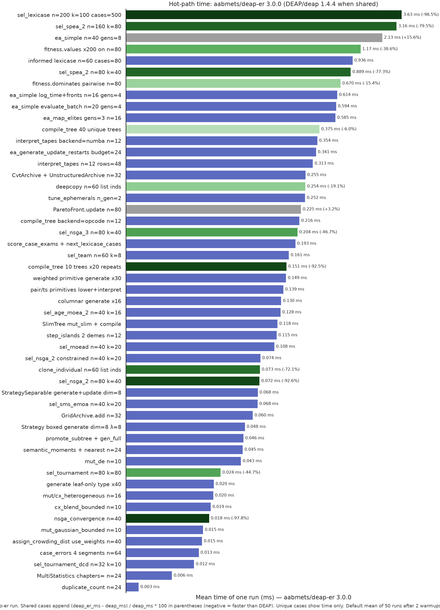

# DEAP-ER


[](https://pypi.org/project/deap-er/)
[](https://github.com/aabmets/deap-er/blob/main/LICENSE)
[](https://codecov.io/gh/aabmets/deap-er)
[](https://github.com/aabmets/deap-er/actions/workflows/pytest-codecov.yml)

[](https://sonarcloud.io/summary/new_code?id=aabmets_deap-er)
[](https://sonarcloud.io/summary/new_code?id=aabmets_deap-er)
[](https://sonarcloud.io/summary/new_code?id=aabmets_deap-er)
[](https://sonarcloud.io/summary/new_code?id=aabmets_deap-er)<br/>
[](https://sonarcloud.io/summary/new_code?id=aabmets_deap-er)
[](https://sonarcloud.io/summary/new_code?id=aabmets_deap-er)
[](https://sonarcloud.io/summary/new_code?id=aabmets_deap-er)
[](https://sonarcloud.io/summary/new_code?id=aabmets_deap-er)

DEAP-ER is a typed evolutionary-algorithm toolbox for Python 3.12 and
newer. Register operators, run an algorithm. The published surface
covers genetic algorithms and mixed encodings, tree and columnar GP
(including memetic and semantic search helpers and a private Push
policy loop), CMA (boxed, separable, restarting, and MO-CMA),
multi-objective and quality-diversity search, case-structured
selection, co-evolution and island stepping, parallel evaluation,
records and checkpoints, and common benchmarks.

The library started as a rewrite of [DEAP](https://github.com/DEAP/deap).
The toolbox model is the same; the API is not a drop-in rename.
Function names, parameter order, and a few contracts changed. The
[differences page](https://aabmets.github.io/deap-er/overview/differences/)
is the migration note.

```bash
pip install deap-er
```
```bash
uv add deap-er
```

## Capabilities

- Genetic algorithms on ordinary Python containers (list, array, set,
  dict, tree, NumPy array, and similar), including mixed encodings
  and differential-evolution variation
- Genetic programming: prefix trees (loosely typed, strongly typed,
  ADFs), SlimGP, columnar programs over named `float64` columns
  with vectorized, causal-window, tape / Numba backends (population
  tape CSE), and a
  private [Push GP](https://aabmets.github.io/deap-er/tutorials/push_gp/)
  policy loop that evolves the search around those tapes
- Program-search helpers: growing language, semantic descriptors,
  memetic ephemeral tuning, and Keijzer affine scaling
- Evolution strategies: CMA, boxed CMA, separable CMA, IPOP/BIPOP
  restarts, and MO-CMA
- Multi-objective search (SPEA-II, NSGA-II, NSGA-III, SMS-EMOA, MOEA/D,
  AGE-MOEA-II) with optional constraint-dominance on NSGA-II
- Quality-diversity search (MAP-Elites: grid, CVT, and unstructured
  archives; novelty selection and iso+line variation)
- Case-structured selection (lexicase, ε-lexicase with dynamic filter
  modes, batch ε-lexicase, case-subset tournament, informed
  down-sampling and generation schedules, program teams, co-evolving
  case exams)
- Cooperative and competitive co-evolution, plus heterogeneous island
  stepping (`step_islands`, ring / fully connected / random migration,
  `island_eval_keys`)
- Parallel evaluation with multiprocessing or
  [Ray](https://github.com/ray-project/ray), plus spawned RNG streams
- Statistics, hall of fame (JSON round-trip), evaluation cache and
  budget, and a NetworkX-compatible genealogy
- Checkpoints that persist a run to disk (`hof` as JSON when
  `hof_ind_cls=` is set)
- Benchmarks against common test functions
- Worked examples of symbolic regression, particle swarm, differential
  evolution, MAP-Elites, mixed encoding, lexicase, columnar GP, and
  CMA (boxed, separable, restarting)

## Relative to DEAP

Same toolbox model. Counted from the
[differences](https://aabmets.github.io/deap-er/overview/differences/)
inventory:

- **18** still-open [DEAP](https://github.com/DEAP/deap) issues
  [implemented](https://aabmets.github.io/deap-er/bugfixes/deap_fixes/) (some older than a decade)
- **84** correctness bugs fixed — [operators](https://aabmets.github.io/deap-er/bugfixes/operators/),
  [GP](https://aabmets.github.io/deap-er/bugfixes/gp/),
  [CMA](https://aabmets.github.io/deap-er/bugfixes/strategies/),
  [records](https://aabmets.github.io/deap-er/bugfixes/records/),
  [checkpoints](https://aabmets.github.io/deap-er/bugfixes/persistence/),
  published [benchmarks](https://aabmets.github.io/deap-er/bugfixes/benchmarks/),
  [creator](https://aabmets.github.io/deap-er/bugfixes/creator/),
  [utilities](https://aabmets.github.io/deap-er/bugfixes/utilities/),
  and [algorithms](https://aabmets.github.io/deap-er/bugfixes/algorithms/)
- **60** capabilities DEAP does not have, including boxed CMA,
  mixed-gene mutation, logbook JSON,
  [columnar GP](https://aabmets.github.io/deap-er/tutorials/columnar_gp/),
  and [Push GP](https://aabmets.github.io/deap-er/tutorials/push_gp/)

The package is typed, uses snake_case, and is Apache-2.0. Hypervolume
work delegates to [moocore](https://pypi.org/project/moocore/).

## Documentation

See the [documentation](https://aabmets.github.io/deap-er/) for the
complete guide.

## Performance

On the same genomes and GP expressions, deap-er is faster where DEAP
still walks Python loops: NSGA convergence (~50×), NSGA-II (~21×),
cached `compile_tree` (~18×), SPEA-II (~5×), and `clone_individual`
(~4×). Tournament selection is about 2× after a batched integer draw.
A tiny `ea_simple` OneMax loop stays a bit behind (~0.87×). Flip-bit
mutation drains leftover uniforms with `rng.take_floats`, but `var_and`
still draws one scalar `rng.random()` per mate-or-skip and per
mutate-or-skip.



Each bar is the mean time of one deap-er run. Shared cases append
the percent change versus DEAP
(`(deap_er − deap) / deap × 100`; negative is faster). Details and
how to reproduce are on the
[performance page](https://aabmets.github.io/deap-er/overview/performance/).

## Acknowledgments

DEAP-ER started as a rewrite of [DEAP](https://github.com/DEAP/deap),
originally developed at the Computer Vision and Systems Laboratory (CVSL)
at Université Laval.

The original DEAP authors and main contributors, in alphabetical order:

- François-Michel De Rainville
- Félix-Antoine Fortin
- Christian Gagné
- Olivier Gagnon
- Marc-André Gardner
- Simon Grenier
- Yannick Hold-Geoffroy
- Marc Parizeau

If you use this library in a scientific paper, please also cite the original
DEAP paper (see [`CITATION.cff`](CITATION.cff)):

```bibtex
@article{DEAP_JMLR2012,
  author  = {F{\'e}lix-Antoine Fortin and Fran{\c{c}}ois-Michel {De Rainville}
             and Marc-Andr{\'e} Gardner and Marc Parizeau and Christian Gagn{\'e}},
  title   = {{DEAP}: Evolutionary Algorithms Made Easy},
  journal = {Journal of Machine Learning Research},
  volume  = {13},
  year    = {2012},
  pages   = {2171--2175}
}
```
